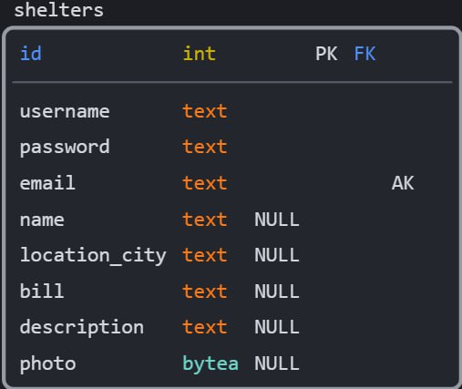
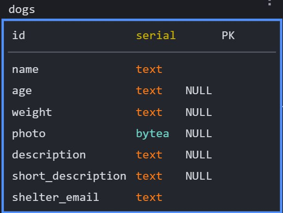
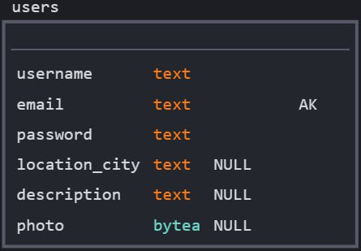

## Содержание баз данных:
# Структура базы данных

Этот файл README описывает структуру таблиц базы данных, используемых в проекте PetLink, детализируя назначение и типы данных каждого столбца в этих таблицах. Ниже приведены описания каждой таблицы вместе с примерами данных, которые они могут содержать.

## Таблицы

### 1. Shelters

**Назначение**: Эта таблица хранит информацию о приютах.

| Столбец        | Тип данных | Описание                                        |
|----------------|------------|-------------------------------------------------|
| id             | int        | Уникальный идентификатор приюта                 |
| username       | text       | Имя пользователя приюта                         |
| password       | text       | Пароль приюта                                   |
| email          | text       | Email приюта (уникальный)                       |
| name           | text       | Название приюта                                 |
| location_city  | text       | Город расположения приюта                       |
| bill           | text       | Счет приюта                                     |
| description    | text       | Описание приюта                                 |
| photo          | bytea      | Фото приюта                                     |

#### Пример данных

    

### 2. Dogs

**Назначение**: Таблица содержит информацию о собаках.

| Столбец             | Тип данных | Описание                                |
|---------------------|------------|-----------------------------------------|
| id                  | serial     | Уникальный идентификатор собаки         |
| name                | text       | Имя собаки                              |
| age                 | text       | Возраст собаки                          |
| weight              | text       | Вес собаки                              |
| photo               | bytea      | Фото собаки                             |
| description         | text       | Описание собаки                         |
| short_description   | text       | Краткое описание собаки                 |
| shelter_email       | text       | Email приюта, в котором находится собака|

#### Пример данных

    

### 3. Users

**Назначение**: В этой таблице хранится информация о пользователях системы.

| Столбец        | Тип данных | Описание                            |
|----------------|------------|-------------------------------------|
| username       | text       | Имя пользователя                    |
| email          | text       | Email пользователя (уникальный)     |
| password       | text       | Пароль пользователя                 |
| location_city  | text       | Город расположения пользователя     |
| description    | text       | Описание пользователя               |
| photo          | bytea      | Фото пользователя                   |

#### Пример данных

